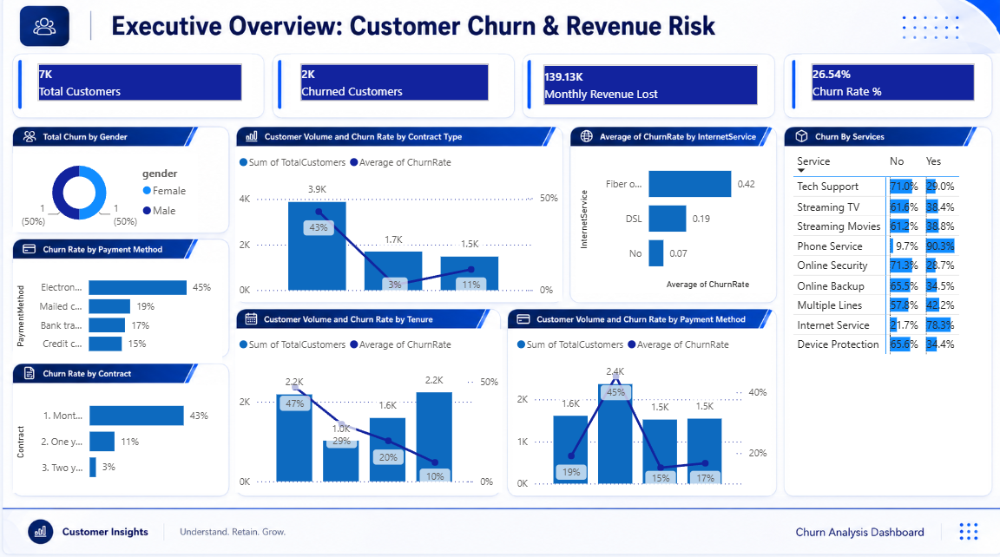
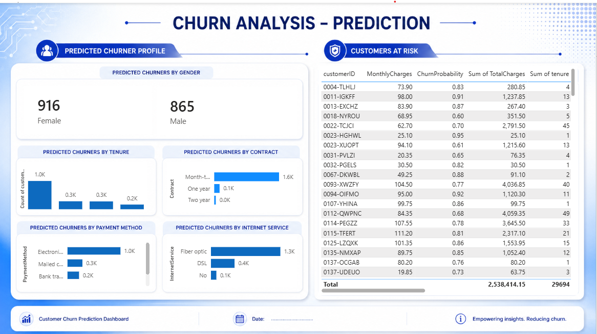

# Telco Customer Churn Analysis and Prediction

An end-to-end data analytics portfolio project that combines **SQL Server, Power BI, Python and machine learning** to investigate customer churn, quantify revenue risk and identify customers most likely to leave a telecommunications provider.

## Dashboard previews

### Executive Overview



### Churn Prediction



## Project purpose

Customer churn directly affects recurring revenue and increases the cost of acquiring replacement customers. This project was created to help a telecommunications business answer three practical questions:

1. **How much churn is occurring and how much monthly revenue is at risk?**
2. **Which customer, contract, service and payment characteristics are most strongly associated with churn?**
3. **Which individual customers should be prioritised for retention activity?**

The result is a two-page Power BI report: an **Executive Overview** for descriptive analysis and a **Churn Prediction** page for customer-level risk monitoring.

## Business outcomes

The analysis turns raw customer records into decision-ready insights that can support:

- Targeted retention campaigns for high-risk customers
- Contract-migration offers for month-to-month customers
- Service and support improvements for vulnerable segments
- Revenue-risk monitoring by contract, payment method and internet service
- Prioritised outreach using model-generated churn probabilities

## Key results

The source dataset contains **7,043 customers**, of whom **1,869 churned**, producing an overall churn rate of **26.54%**. Churned customers account for approximately **$139,130.85 in monthly charges**.

Major patterns identified:

- **Month-to-month contracts** had the highest churn rate at approximately **42.71%**, compared with 11.27% for one-year and 2.83% for two-year contracts.
- Customers paying by **electronic check** had a churn rate of approximately **45.29%**, the highest among payment methods.
- **Fibre optic** customers recorded a churn rate of approximately **41.89%**, substantially above DSL customers.
- Customers without **online security** or **technical support** had churn rates above **41%**.
- The Random Forest holdout evaluation achieved approximately **77.43% accuracy** and **0.814 ROC AUC**.
- The strongest model features included `TotalCharges`, `MonthlyCharges`, `tenure`, fibre-optic service and electronic-check payment.

## Dashboard pages

### 1. Executive Overview

Designed for managers and analysts to monitor:

- Total customers and churned customers
- Churn and retention rates
- Monthly revenue lost
- Contract, payment method, tenure and service-related churn patterns
- Customer volume and churn-rate comparisons

### 2. Churn Prediction

Designed for retention teams to review:

- Predicted churner profiles by gender, tenure, contract, payment method and internet service
- Customer-level churn predictions
- Churn probability and risk prioritisation
- Charges and account details for customers requiring intervention

## Technical workflow

```text
Raw CSV
   ↓
SQL Server staging table
   ↓
SQL exploration and reporting views
   ↓
Power BI executive dashboard
   ↓
Python preprocessing and Random Forest model
   ↓
Customer churn probabilities
   ↓
Power BI churn-prediction dashboard
```

## Tools and technologies

- **SQL Server / SSMS:** data exploration, KPI calculations and reusable reporting views
- **Power BI:** data modelling, DAX measures, interactive dashboards and customer-risk reporting
- **Python:** data preparation, categorical encoding, model training, evaluation and prediction export
- **Pandas / NumPy:** data manipulation
- **scikit-learn:** Random Forest classification and model evaluation
- **Jupyter Notebook:** reproducible machine-learning workflow
- **Excel / CSV:** intermediate inspection and data exchange

## Repository structure

```text
telco-customer-churn-analysis/
├── data/
│   ├── raw/                    # Original Telco churn dataset
│   └── processed/              # Customer-level modelling dataset
├── docs/                       # Data dictionary and supporting documentation
├── notebooks/                  # Reproducible ML notebook
├── outputs/                    # Prediction output used by Power BI
├── powerbi/                    # Power BI report file
├── screenshots/                # Dashboard preview image
├── sql/                        # Database setup, analysis and reporting views
├── .gitignore
├── LICENSE
├── README.md
└── requirements.txt
```

## SQL components

- `01_database_setup.sql` provides database setup and import guidance.
- `02_exploratory_analysis.sql` contains descriptive analysis for customer, churn and revenue patterns.
- `03_dashboard_views.sql` creates reusable views for Power BI, including executive KPIs, contract analysis, payment-method analysis, tenure analysis and customer-level datasets.

## Machine-learning approach

The customer-level dataset was prepared by:

1. Removing the unique customer identifier from the model features
2. Converting `TotalCharges` to numeric values and imputing blanks with the median
3. Mapping the churn target to binary values
4. One-hot encoding categorical variables
5. Creating a stratified 80/20 train-test split
6. Training a Random Forest classifier with 100 trees
7. Evaluating accuracy, precision, recall, F1 score and ROC AUC
8. Exporting churn labels and probabilities for Power BI

### Holdout evaluation

| Metric | Result |
|---|---:|
| Accuracy | 77.43% |
| Precision (churn class) | 59.93% |
| Recall (churn class) | 45.19% |
| F1 score (churn class) | 51.52% |
| ROC AUC | 0.814 |

The model is useful as a portfolio baseline and ranking tool, but churn-class recall shows that further tuning is needed before operational deployment.

## How to run the project

### 1. SQL Server

1. Run `sql/01_database_setup.sql`.
2. Import `data/raw/telco_customer_churn.csv` into `dbo.stg_Churn` using SSMS.
3. Run `sql/02_exploratory_analysis.sql`.
4. Run `sql/03_dashboard_views.sql`.

### 2. Python model

```bash
python -m venv .venv
.venv\Scripts\activate
pip install -r requirements.txt
jupyter notebook
```

Open `notebooks/churn_prediction_model.ipynb` and run the cells from the repository root.

### 3. Power BI

Open:

```text
powerbi/telco_churn_dashboard.pbix
```

Update data-source paths or SQL Server credentials when prompted, then refresh the report.

## Recommended retention actions

- Prioritise month-to-month customers with high monthly charges for contract-conversion offers.
- Investigate service experience and pricing for fibre-optic customers.
- Offer online-security and technical-support bundles to customers without these services.
- Review electronic-check payment journeys and promote automatic payment options.
- Use churn probabilities to rank customers for proactive outreach rather than treating all customers equally.

## Limitations and future improvements

- The dataset is a public, static sample and does not include behavioural event data, support-ticket history or competitor pricing.
- Model recall for churners should be improved through class weighting, threshold optimisation, cross-validation and comparison with gradient-boosting models.
- Model scoring in this portfolio version uses the available customer dataset; a production workflow should score genuinely unseen future customers.
- Feature importance indicates association within the model, not causal impact.
- Future versions could add SHAP explanations, automated pipelines and monitoring for model drift.

## Author

**Qasim Ali**  
Computer Science graduate focused on data analytics, AI and machine-learning applications.
